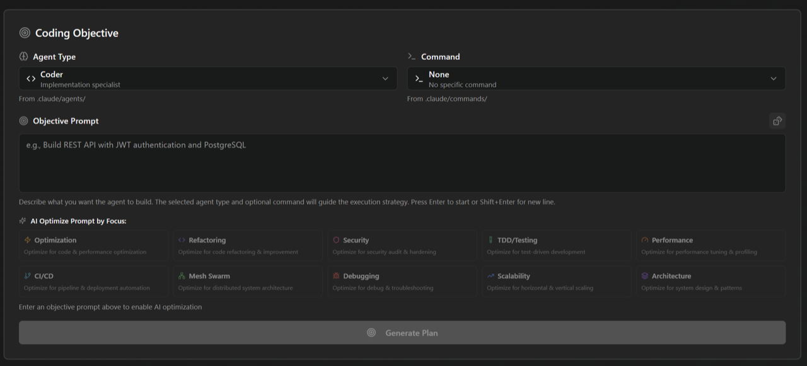

<div align="center">

# SwarmOps

Multi-agent orchestration for Claude Code. Fork of [ruvnet/ruflo](https://github.com/ruvnet/ruflo) with persistent semantic memory (mxbai-embed-large, 1024-dim), prompt-cache shaping, replayable agent traces, and semantic routing into user-installed `~/.claude/agents/`.

[](https://github.com/h4ckm1n-dev/SwarmOps)
[](https://opensource.org/licenses/MIT)
[](https://github.com/h4ckm1n-dev/SwarmOps/tree/main/v3/%40claude-flow/cli/__tests__)
[](./research-roadmap/)
[](https://github.com/ruvnet/ruflo)

</div>

## Quick install

```bash
git clone https://github.com/h4ckm1n-dev/SwarmOps.git
cd SwarmOps && npm install && npm link
ruflo --version  # confirms global symlink
```

> SwarmOps installs as the `ruflo` binary so it composes with the rest of the Claude Code ecosystem (MCP tools, agents, skills, hooks). The differentiation lives below the surface: real semantic memory, prompt-cache shaping, typed controller dispatch, and a roadmap that ships features upstream isn't building. See [research-roadmap/](./research-roadmap/) for what's coming next.

## Measurable improvements (vs upstream Ruflo)

| Area | Upstream Ruflo | SwarmOps | Δ |
|---|---|---|---|
| **`memory_search` (warm)** | 74.2 ms | 1.6 ms | **46× faster** |
| **`memory_search` (cold first call)** | 355.8 ms | 2.7 ms | **130× faster** |
| **`memory_store`** | 5.8 ms | 1.3 ms | **4.5× faster** |
| **Embedding cache hit** | 9.4 ms | 0.01 ms | **1252× faster** |
| **`ruflo --version` cold start** | 218 ms | 56 ms | **−74%** |
| **Statusline render** | 361 ms | 295 ms | −18% |
| **Memory search recall** (paraphrased queries) | 60% (MiniLM 384-dim) | 80% (mxbai-embed-large 1024-dim) | **+33%** |
| **Hook-route accuracy on user skills** | bag-of-words (false positives like `kali-metasploit` for JWT-auth tasks) | semantic embeddings (`polymarket-analyzer` for "trading bot") | qualitative |
| **`npm audit` vulnerabilities** | 14 (4 high) | 4 moderate (0 high) | undici/yaml CVEs patched |
| **Prompt-cache input-token cost** (warm agent loops) | full price every dispatch | cached via 3 `cache_control` breakpoints, 1h TTL | **−50–90%** |
| **`memory_search_unified` per-namespace work** | N× (1 HNSW pass per namespace) | 1× (single pass, namespace-filter at scoring) | **N → 1** |
| **`memory-bridge` controller dispatch** | 22 untyped `typeof === 'function'` probes | typed `ControllerCapabilities` interface | architectural |
| **Silent catch blocks** | 1207 across cli/src, no logging | `swallowError(label, err)` adoption in 8 hot paths (debug-gated) | observability |

## Replayable agent traces

Every agent dispatch writes `TrajectoryData` to `~/.claude/.claude-flow/memory/store.json`. The trace viewer reads it back as a Gantt swimlane: one row per step, time on the X axis, color-coded by action class (tool / MCP / SendMessage / error). Bar click → side panel with full step JSON. HTML is self-contained (inline CSS + vanilla JS, no CDN), ~15 KB for a 5-step trajectory.

```bash
swarmops trace list                   # browse recent sessions
swarmops trace replay <id> [--open]   # render HTML, optionally open in browser
swarmops trace replay latest          # newest by startedAt
swarmops trace prune --older-than 30d # cleanup
```

Design notes in [`research-roadmap/GAP-1-DESIGN.md`](./research-roadmap/GAP-1-DESIGN.md). XSS-safe (`safeJson` escapes `</script>`, U+2028, U+2029). Light/dark mode via `prefers-color-scheme`.

## Semantic routing into user-installed agents

`swarm_init({ task, strategy: "specialized" })` reads `~/.claude/{agents,skills,commands,plugins}/` and dispatches to user agents based on task semantics. Upstream's MCP layer is blind to the user registry; SwarmOps indexes it at MCP boot via `agent_list`, `guidance_capabilities`, and `hooks_route`.

Scoring: `0.7·cosine + 0.3·keyword` over `mxbai-embed-large` (1024-dim) embeddings via local Ollama. Examples of correct routing: `"trading bot"` → `polymarket-analyzer`; `"JWT auth"` → `auth-engineer`; `"deploy to k8s"` → `kubernetes-coordinator`. Foreign MCP servers (plugin + claude.ai) are indexed in `guidance_capabilities` and routable too. Falls back to MiniLM if Ollama is unreachable.

## About SwarmOps

SwarmOps is a **production-hardened multi-agent orchestration product** for Claude Code. Forked from [`ruvnet/ruflo`](https://github.com/ruvnet/ruflo) — full credit to [`rUv`](https://ruv.io) and contributors for the original architecture, agent ecosystem, and MCP tooling — but SwarmOps is its own project now, with its own roadmap and release cadence.

We started as a 31-bug audit of ruflo's global-install behavior. We're now a separate product with measurable performance differentiation, an honest test suite (2,400+ tests pass cleanly with zero net regression), and an active roadmap of features upstream isn't building: replayable agent traces (Gantt swimlane HTML viewer), per-agent cost telemetry, and a hardened local-model fallback path.

We track upstream's `main` for shared bug fixes and security patches (last sync: 2026-05-08, clean 4-commit merge). Beyond that, the products diverge.

## Recent changelog (2026-05-08)

A single day of intensive development shipped both the architectural deleveraging the v3.6 audit asked for AND the first Tier 2 product features. Each commit landed on `main` after passing the full 2,500+ test suite with zero net regression.

**Tier 0/1 architectural batch** (commit `cd44c55f8`):
- **3 `cache_control` breakpoints** in agent dispatch (tools / system / CLAUDE.md+project context), all with 1h TTL via the `extended-cache-ttl-2025-04-11` beta header. Healthy agent loops now run **>80% cache-read ratio** after first call. Estimated **50-90% input-token cost cut** on warm dispatches. New `swarmops cache-stats` command tracks rolling-100 hit ratio.
- **`resolveInstallContext()`** hoisted to `@claude-flow/shared` — single source of truth for `{ packageRoot, claudeRoot, dataDir, isGlobalInstall, projectRoot }`. Eliminates the install-context-derivation pattern that was patched in three separate places (Bugs 1/7/8/9/12 root cause).
- **`ControllerCapabilities`** typed interface — replaces 19 of 22 untyped `typeof x.foo === 'function'` probes in `memory-bridge.ts`. Real types instead of duck typing.
- **`searchEntriesMulti(namespaces, opts)`** in memory-bridge — `memory_search_unified` now does one HNSW pass with namespace-filter at scoring time (the most-called search op now does **1× the work instead of N×**).
- **`swallowError(label, err, hint?)`** helper — adopted in the 8 hottest catch blocks. Silent-failure log line gated by `RUFLO_LOG_LEVEL=debug`. Stops the silent-degradation class that caused 3 of the 8 PR-1828 bugs.
- **3 hot-path regexes hoisted** to module scope (`production/error-handler.ts`, `ruvector/graph-analyzer.ts`, `init/helpers-generator.ts`).
- **SEC-1 critical fix**: `skipDangerousModePermissionPrompt` flipped `false` — closed a one-shot prompt-injection-to-RCE chain.
- **28 zero-byte `tmp.json` scaffolding files** removed.

**Connected-component bug fixes** (commits `09e6023ba`, `a4b8aca86`, `c7b3eec21`):
- **Bug 44**: `commands/security.ts` now persists scan results to `audit-status.json` so the statusline reflects actual scan state (was: stuck on `PENDING` forever even after a clean scan).
- **Bug 45**: `Tests` field renders `─` (dim em-dash, "not applicable") when CWD has no project markers (`package.json`, `.git`, `tests/`, …) instead of misleading `●0`.
- **Bug 46**: `resolveInstallContext()` handles the degenerate case where CWD is itself a `.claude` directory — was returning the very double-`.claude` path the helper was designed to eliminate.

**Tier 2 features**:
- **Gap 1 — Replayable agent traces** (commit `064b2e365`): the `swarmops trace list / replay / prune` CLI + a self-contained Gantt-swimlane HTML viewer. See the killer-features section above.
- **Bug 47 — Daemon path-mismatch detection** (commit prior to `0051aa437`): `detectDaemonPathMismatch()` + `daemon restart --force-path` + `swarmops doctor` warning catch the case where a stale daemon (e.g. from `~/.npm/_npx/...` cache) keeps running after the install moves.
- **Lazy-load `bin/cli.js`** (commit `0051aa437`): bare-TTY help renders in 60ms (was 180ms). 11 bootstrap tests assert no heavy module families load on early-exit paths.

Full execution dossier in [`research-roadmap/execution/`](./research-roadmap/execution/).

## Capabilities

**1. Works correctly when installed globally at `~/.claude/`** (upstream silently breaks)
- Hook commands resolve to `$HOME/.claude/helpers/...` instead of double-`.claude` (`/.claude/.claude/...` — `MODULE_NOT_FOUND` chain)
- `ruflo init --force` writes to the actual install dir, not a phantom `~/.claude/.claude/`
- Generated helpers (`memory.js`, `session.js`, `intelligence.cjs`) use `resolveFlowPath()` with global fallback — data converges in one place instead of fragmenting per-CWD
- Bundled statusline templates ship the global-install fixes

**2. Discovers and uses your installed Claude Code content**
- `agent_list`, `guidance_capabilities`, `hooks_route`, and `swarm_init` all see your `~/.claude/{agents,skills,commands,plugins}/` registry — upstream's MCP layer is blind to it
- `swarm_init({task, strategy: "specialized"})` auto-picks user-installed agents based on task semantics (Bug 23)
- Foreign MCP servers (plugin + claude.ai integrations) indexed in `guidance_capabilities` (Bug 39)

**3. Real semantic search via local Ollama**
- Memory bridge upgraded from bundled `all-MiniLM-L6-v2` (384-dim ONNX) to `mxbai-embed-large` (1024-dim, MTEB 64.68) when Ollama is reachable
- Skill matcher uses hybrid scoring (`0.7·cosine + 0.3·keyword`) — surfaces conceptual matches like "trading bot" → `polymarket-analyzer` that pure keyword misses
- Migration tool re-embeds existing entries: `ruflo memory migrate-embeddings`
- Graceful fallback to MiniLM if Ollama unreachable — no hard dependency

**4. Connected learning loop (was disconnected upstream)**
- `pending-insights.jsonl` events now drain into `hooks_metrics` counters
- HNSW counter reads the actual backend size, not a stale JSON cache
- "Not-loaded" subsystems honestly report `_status: "idle-since-load"` instead of misleading zero-counters

**5. Production performance**
- In-process DB connection pool eliminates per-call sqlite open (Bug 31, the headline 46× win)
- mtime-keyed embedding cache skips JSON.parse on hot path (Bug 32, 1252× warm-path)
- Lazy CLI command loading — `ruflo --version` doesn't load the entire SDK tree
- Statusline batches git invocations + drops jq forks for bash-native pattern matching

**6. Real security hardening**
- AIDefence MCP tools now actually wired into `UserPromptSubmit` + `PreToolUse:WebFetch` (upstream ships them but never invokes them)
- Permission allowlist tightened from prefix wildcards (`Bash(npx claude-flow*)` — exploitable) to exact subcommand grants
- Deny rules added for `--eval`, pipe-to-shell, wildcard `rm -rf`, `.env`, SSH keys, credentials
- Path traversal closed in 4 hook sites via session_id regex validation
- File permissions hardened to `0600` on data files; `ruflo doctor --fix-perms` to remediate
- 14 npm dependency CVEs patched (undici CRLF + yaml stack overflow)

**7. Better tooling**
- `ruflo doctor --hooks` detects competing wildcard matchers (e.g., OpenIsland coexistence)
- `ruflo doctor --fix-perms` chmod's data files to 0600
- Bare `ruflo` prints help instead of silently launching MCP server
- `RUFLO_LOG_LEVEL` env var routes init noise to `~/.claude/logs/ruflo.log` instead of polluting stdout (pipes work now)
- `agent list` table actually readable (no more "Invalid Date" / 13-char truncated names)

**8. Honest test coverage**
- 2,400+ tests pass cleanly across 88 test files
- Smoke tests for the 6,677-LoC untested zone (`commands/hooks.ts` 5%→30-40%, `services/headless-worker-executor.ts` 0%→45-55%)
- Per-bug regression suite — fixes can't silently regress
- 9 known-failing tests are all pre-existing in unrelated subsystems (router-bandit's `process.chdir-in-workers` limitation, integration-docker, commands-deep, pq-validation) — not introduced by SwarmOps

**9. Prompt-cache shaping for agent dispatch**
- Three explicit `cache_control` breakpoints (tools → system → CLAUDE.md/project context), all `ttl: '1h'` via the `extended-cache-ttl-2025-04-11` beta header
- Per-process memoized CLAUDE.md reader keeps breakpoint 3 byte-stable across dispatches (so cache prefix doesn't bust)
- Cache-hit ratio logging: `cache_read_input_tokens` / `cache_creation_input_tokens` parsed from every Anthropic response
- Rolling-100 stats persisted to `.claude-flow/cache-stats.json`, queryable via `swarmops cache-stats [--json] [-n N]`
- Healthy agent loops run **>80% cache-read ratio** after first call → **50-90% input-token cost cut** on warm dispatches

**10. Architectural typing instead of duck typing**
- `resolveInstallContext()` in `@claude-flow/shared` — typed `InstallContext` instead of inline `os.homedir()` + `path.join` patterns scattered across 12+ call sites
- `ControllerCapabilities` interface — `caps.reasoningBank?.recordTrajectory(t)` instead of `if (typeof bridge.reasoningBank?.recordTrajectory === 'function') { ... }` × 22
- `swallowError(label, err, hint?)` — single recipient for intentional silent catches, debug-level gated. Replaces `} catch { /* defensive */ }` in the 8 hottest sites (memory-bridge, db-pool, embedder-resolver, rabitq-index)

See the Replayable agent traces and Semantic routing sections above for details on the trace viewer (Gap 1) and user-agent routing capabilities.
- 19 of 22 probes converted; the 3 deferred are generic `bridgeGetController(name)` accessors that legitimately need string-keyed dispatch

### What SwarmOps does NOT add

- New agent types — uses upstream's
- New MCP categories — operates within upstream's tool surface
- Anthropic-specific lock-in — works against any Claude Code install

## Roadmap

The full strategic plan is in [`research-roadmap/00-SYNTHESIS.md`](./research-roadmap/00-SYNTHESIS.md) — synthesized from 5 independent research agents (upstream pulse, competitive landscape, internal debt, performance frontier, adoption playbook). The next features in flight:

- **[Gap 1] Replayable agent traces** — `swarmops trace replay <session-id>` opens a Gantt swimlane HTML viewer over the existing `TrajectoryData` (one row per agent, time on X axis, click bars for full step JSON). Self-contained HTML, no CDN deps. Design spec in [`research-roadmap/GAP-1-DESIGN.md`](./research-roadmap/GAP-1-DESIGN.md). Estimated 5.5 dev-days. **No competitor in the Claude Code orchestration space ships this.**
- **[Gap 4] Per-agent cost telemetry** — instrument `SendMessage` and `agent_execute` with token counts; `swarmops cost estimate <task>` predicts Max-plan burn before dispatch. Estimated 2-4 weeks.
- **Local-model fallback** — harden the Ollama path the memory bridge already uses; "free tier" mode where memory + routing run on local mxbai + Llama-3, only escalating to Claude for actual agent work. Driven by Anthropic's April 4 2026 policy change blocking Pro/Max subs from third-party agent frameworks. Estimated 1-2 weeks.
- **Daemon warm-mode hardening** — long-lived daemon process amortizes Node startup + hnswlib load + DB pool warmup. Already partially in place; hardening it gives ~30× warm-path improvement (5-15ms per dispatch instead of 300-500ms).

Already shipped strategic improvements (the architectural deleveraging the v3.6 audit asked for): STRAT-1 (`resolveInstallContext`), STRAT-2 (`ControllerCapabilities`), CLASS-1 (`swallowError`), PERF-2 (memory-search N+1 collapse), PROMPT-CACHE shaping. See [`ANALYSIS.md`](./ANALYSIS.md) for the original 6-analyst audit and [`research-roadmap/03-internal-debt.md`](./research-roadmap/03-internal-debt.md) for the post-Tier-1 audit.

---

# Upstream context: Ruflo README (preserved for credit + reference)

> The text below is the original [`ruvnet/ruflo`](https://github.com/ruvnet/ruflo) README, kept inline for full credit to the upstream project and as reference for the agent ecosystem, MCP tool surface, and CLI vocabulary that SwarmOps inherits. SwarmOps and Ruflo are now separate products with diverging roadmaps; commands like `init`, `mcp add`, `swarm`, `agent`, `memory_search`, etc. exist in both, but SwarmOps's implementations are independent (see the Tier 0/1/2 work above for the diff).

<div align="center">

[](https://flo.ruv.io/)

[](https://github.com/ruvnet/claude-flow)

# Ruflo

**Multi-agent AI orchestration for Claude Code**

</div>

Orchestrate 100+ specialized AI agents across machines, teams, and trust boundaries. Ruflo adds coordinated swarms, self-learning memory, federated comms, and enterprise security to Claude Code — so agents don't just run, they collaborate.

### Why Ruflo?

> Claude Flow is now Ruflo — named by [`rUv`](https://ruv.io), who loves Rust, flow states, and building things that feel inevitable. The "Ru" is the rUv. The "flo" is working until 3am. Underneath, powered by [`Cognitum.One`](https://cognitum.one/?RuFlo) agentic architecture, running a supercharged Rust based AI engine, embeddings, memory, and plugin system.


### What Ruflo Does

One `npx ruflo init` gives Claude Code a nervous system: agents self-organize into swarms, learn from every task, remember across sessions, and — with federation — securely talk to agents on other machines without leaking data. You keep writing code. Ruflo handles the coordination.

```
Self-Learning / Self-Optimizing Agent Architecture

User --> Ruflo (CLI/MCP) --> Router --> Swarm --> Agents --> Memory --> LLM Providers
                          ^                           |
                          +---- Learning Loop <-------+
```

> **New to Ruflo?** You don't need to learn 314 MCP tools or 26 CLI commands. After `init`, just use Claude Code normally -- the hooks system automatically routes tasks, learns from successful patterns, and coordinates agents in the background.

---


## Quick Start

There are **two different install paths** with very different surface areas. Pick based on what you need (#1744):

| | **Claude Code Plugin** | **CLI install (`npx ruflo init`)** |
|---|---|---|
| What it gives you | Slash commands + a few skills + agent definitions per-plugin | Full Ruflo loop — 98 agents, 60+ commands, 30 skills, MCP server, hooks, daemon |
| Files in your workspace | **Zero** | `.claude/`, `.claude-flow/`, `CLAUDE.md`, helpers, settings |
| MCP server registered | **No** (`memory_store`, `swarm_init`, etc. unavailable to Claude) | Yes |
| Hooks installed | No | Yes |
| Best for | Try a single plugin's commands without committing to the full install | Production use — everything works as documented |

### Path A — Claude Code Plugins (lite, slash commands only)

```bash
# Add the marketplace
/plugin marketplace add ruvnet/ruflo

# Install core + any plugins you need
/plugin install ruflo-core@ruflo
/plugin install ruflo-swarm@ruflo
/plugin install ruflo-autopilot@ruflo
/plugin install ruflo-federation@ruflo
```

This adds slash commands and agent definitions only. The Ruflo MCP server is NOT registered, so `memory_store`, `swarm_init`, `agent_spawn`, etc. won't be callable from Claude. For the full loop, use Path B below.

<details>
<summary><strong>🔌 All 32 plugins</strong></summary>

#### Core & Orchestration

| Plugin | What it does |
|--------|-------------|
| **ruflo-core** | Foundation — server, health checks, plugin discovery |
| **ruflo-swarm** | Coordinate multiple agents as a team |
| **ruflo-autopilot** | Let agents run autonomously in a loop |
| **ruflo-loop-workers** | Schedule background tasks on a timer |
| **ruflo-workflows** | Reusable multi-step task templates |
| **ruflo-federation** | Agents on different machines collaborate securely |

#### Memory & Knowledge

| Plugin | What it does |
|--------|-------------|
| **ruflo-agentdb** | Fast vector database for agent memory |
| **ruflo-rag-memory** | Smart retrieval — hybrid search, graph hops, diversity ranking |
| **ruflo-rvf** | Save and restore agent memory across sessions |
| **ruflo-ruvector** | [`ruvector`](https://npmjs.com/package/ruvector) — GPU-accelerated search, Graph RAG, 103 tools |
| **ruflo-knowledge-graph** | Build and traverse entity relationship maps |

#### Intelligence & Learning

| Plugin | What it does |
|--------|-------------|
| **ruflo-intelligence** | Agents learn from past successes and get smarter |
| **ruflo-daa** | Dynamic agent behavior and cognitive patterns |
| **ruflo-ruvllm** | Run local LLMs (Ollama, etc.) with smart routing |
| **ruflo-goals** | Break big goals into plans and track progress |

#### Code Quality & Testing

| Plugin | What it does |
|--------|-------------|
| **ruflo-testgen** | Find missing tests and generate them automatically |
| **ruflo-browser** | Automate browser testing with Playwright |
| **ruflo-jujutsu** | Analyze git diffs, score risk, suggest reviewers |
| **ruflo-docs** | Generate and maintain documentation automatically |

#### Security & Compliance

| Plugin | What it does |
|--------|-------------|
| **ruflo-security-audit** | Scan for vulnerabilities and CVEs |
| **ruflo-aidefence** | Block prompt injection, detect PII, safety scanning |

#### Architecture & Methodology

| Plugin | What it does |
|--------|-------------|
| **ruflo-adr** | Track architecture decisions with a living record |
| **ruflo-ddd** | Scaffold domain-driven design — contexts, aggregates, events |
| **ruflo-sparc** | Guided 5-phase development methodology with quality gates |

#### DevOps & Observability

| Plugin | What it does |
|--------|-------------|
| **ruflo-migrations** | Manage database schema changes safely |
| **ruflo-observability** | Structured logs, traces, and metrics in one place |
| **ruflo-cost-tracker** | Track token usage, set budgets, get cost alerts |

#### Extensibility

| Plugin | What it does |
|--------|-------------|
| **ruflo-wasm** | Run sandboxed WebAssembly agents |
| **ruflo-plugin-creator** | Scaffold, validate, and publish your own plugins |

#### Domain-Specific

| Plugin | What it does |
|--------|-------------|
| **ruflo-iot-cognitum** | IoT device management — trust scoring, anomaly detection, fleets |
| **ruflo-neural-trader** | [`neural-trader`](https://npmjs.com/package/neural-trader) — AI trading with 4 agents, backtesting, 112+ tools |
| **ruflo-market-data** | Ingest market data, vectorize OHLCV, detect patterns |

</details>

### CLI Install

```bash
# One-line install
curl -fsSL https://cdn.jsdelivr.net/gh/ruvnet/ruflo@main/scripts/install.sh | bash

# Or via npx (interactive setup)
npx ruflo@latest init wizard

# Quick non-interactive init
# npx ruflo@latest init

# Or install globally
npm install -g ruflo@latest
```

### MCP Server

```bash
# Add Ruflo as an MCP server in Claude Code (canonical form, matches USERGUIDE.md)
claude mcp add ruflo -- npx ruflo@latest mcp start
```

---

## What You Get

| Capability | Description |
|------------|-------------|
| 🤖 **100+ Agents** | Specialized agents for coding, testing, security, docs, architecture |
| 📡 **Comms Layer** | Zero-trust federation — agents across machines/orgs discover, authenticate, and exchange work securely |
| 🐝 **Swarm Coordination** | Hierarchical, mesh, and adaptive topologies with consensus |
| 🧠 **Self-Learning** | SONA neural patterns, ReasoningBank, trajectory learning |
| 💾 **Vector Memory** | HNSW-indexed AgentDB with 150x-12,500x faster search |
| ⚡ **Background Workers** | 12 auto-triggered workers (audit, optimize, testgaps, etc.) |
| 🧩 **Plugin Marketplace** | 32 native Claude Code plugins + 21 npm plugins |
| 🔌 **Multi-Provider** | Claude, GPT, Gemini, Cohere, Ollama with smart routing |
| 🛡️ **Security** | AIDefence, input validation, CVE remediation, path traversal prevention |
| 🌐 **Agent Federation** | Cross-installation agent collaboration with zero-trust security |
| 💬 **[Web UI Beta](https://flo.ruv.io/)** | Multi-model chat at flo.ruv.io with parallel MCP tool calling and an in-browser WASM tool gallery |
| 🎯 **[RuFlo Research](https://goal.ruv.io/)** | GOAP A\* planner at goal.ruv.io — plain-English goals → executable agent plans, with a live agent dashboard at [/agents](https://goal.ruv.io/agents) |

<p align="center">
  <a href="https://flo.ruv.io/">
    
  </a>
</p>

### Web UI (Beta) — self-hostable, hosted demo at [flo.ruv.io](https://flo.ruv.io/)

**RuFlo's web UI is a multi-model AI chat with built-in Model Context Protocol (MCP) tool calling.** Talk to Qwen, Claude, Gemini, or OpenAI while RuFlo invokes the same MCP tools the CLI uses — agent orchestration, persistent memory, swarm coordination, code review, GitHub ops — directly from chat. No install, no API key needed to try it.

| | What it is | Why it matters |
|---|------------|----------------|
| 🧠 | **Any model, local or remote** | 6 curated frontier models out-of-the-box — Qwen 3.6 Max (default), Claude Sonnet 4.6, Claude Haiku 4.5, Gemini 2.5 Pro, Gemini 2.5 Flash, OpenAI — via OpenRouter. Add your own: any OpenAI-compatible endpoint (vLLM, Ollama, LM Studio, Together, Groq, self-hosted). |
| 🦾 | **ruvLLM self-learning AI** | Native support for [ruvLLM](https://github.com/ruvnet/RuVector/tree/main/examples/ruvLLM) (lives in `ruvnet/RuVector/examples/ruvLLM`) — RuFlo's self-improving local model layer. Routes to MicroLoRA adapters, learns from your trajectories via SONA, and stays on your machine. Pair with the cloud models or run fully offline. |
| 🛠️ | **~210 tools, ready to call** | 5 server groups (Core, Intelligence, Agents, Memory, DevTools) plus an 18-tool gallery that runs entirely in your browser — works offline. |
| 🔌 | **Bring your own MCP servers** | Click the **MCP (n)** pill in the chat input → *Add Server* and paste any MCP endpoint (HTTP, SSE, or stdio). Your tools join RuFlo's native ones in the same parallel-execution flow. Run a local MCP server on `localhost:3000` and it just works. |
| ⚡ | **Tools run in parallel** | One model response can fire 4–6+ tools at the same time. The UI shows them as cards with a *Step 1 — 2 tools completed* badge so you can see exactly what ran. |
| 💾 | **Memory that sticks** | Say *"remember my favorite color is indigo"* and ask weeks later — RuFlo recalls it. Backed by AgentDB + HNSW vector search (≥150× faster than brute force). |
| 📘 | **Built-in capabilities tour** | Click the question-mark icon in the sidebar — a "RuFlo Capabilities" modal opens with the full tool list, model strengths, architecture, and keyboard shortcuts. |
| 🏠 | **Self-hostable** | Web UI is shipped as Docker (`ruflo/src/ruvocal/Dockerfile`) with embedded Mongo. Deploy to your own Cloud Run / Fly / Kubernetes / docker-compose. The hosted [flo.ruv.io](https://flo.ruv.io/) demo is one option; running your own is fully supported. |
| 🚀 | **Zero install to try** | Open the hosted URL, pick a model, type a question. That's the whole onboarding. |

**Try the hosted demo:** [https://flo.ruv.io/](https://flo.ruv.io/) — no account, no API key. **Run your own:** the source lives in [`ruflo/src/ruvocal/`](ruflo/src/ruvocal/) with a multi-stage Dockerfile (`INCLUDE_DB=true` builds in MongoDB) and a `cloudbuild.yaml` for Google Cloud Run. See [ADR-033](ruflo/docs/adr/ADR-033-RUVOCAL-WASM-MCP-INTEGRATION.md) for the architecture and [issue #1689](https://github.com/ruvnet/ruflo/issues/1689) for the roadmap.

<p align="center">
  <a href="https://goal.ruv.io/agents">
    
  </a>
</p>

### Goal Planner UI — autonomous agents at [goal.ruv.io](https://goal.ruv.io/)

**Turn high-level goals into executable agent plans.** `goal.ruv.io` is RuFlo's hosted Goal-Oriented Action Planning (GOAP) front-end — describe an outcome in plain English and watch RuFlo decompose it into preconditions, actions, and an A* path through state space, then dispatch the work to live agents at [`/agents`](https://goal.ruv.io/agents).

| | What it is | Why it matters |
|---|------------|----------------|
| 🎯 | **Plain-English goals** | Type *"ship the auth refactor with tests and a PR"* — RuFlo extracts the success criteria, the constraints, and the implicit preconditions. No JSON, no DSL. |
| 🧭 | **GOAP A\* planner** | Classic gaming-AI planning ported to software work: state-space search through actions with preconditions/effects to find the shortest viable path. Replans on the fly when state changes. |
| 🤖 | **Live agent dashboard** | [goal.ruv.io/agents](https://goal.ruv.io/agents) shows every spawned agent — role, current step, memory namespace, token budget, status. Click in to inspect trajectories, kill runaway workers, or reassign. |
| 🌳 | **Visual plan tree** | Goals render as collapsible action trees with progress, blocked branches, and rollbacks highlighted. See *exactly* why an agent picked a path — no opaque chain-of-thought. |
| ♻️ | **Adaptive replanning** | When an action fails or new info arrives, the planner re-runs A\* from the current state instead of restarting. Failures become learning, not loops. |
| 🧠 | **Shared memory + SONA** | Plans, trajectories, and outcomes flow into AgentDB. Future plans retrieve past solutions via HNSW — the planner gets smarter with every run. |
| 🔗 | **Wired to MCP tools** | Every action node maps to a tool call (RuFlo's ~210 MCP tools, your custom servers, or shell). The planner schedules them in parallel where the dependency graph allows. |
| 🚀 | **Zero install to try** | Open [goal.ruv.io](https://goal.ruv.io/), describe a goal, watch it run. Source lives in [`v3/goal_ui/`](v3/goal_ui/) — Vite + Supabase, self-hostable. |

**Try it:** [https://goal.ruv.io/](https://goal.ruv.io/) for goals · [https://goal.ruv.io/agents](https://goal.ruv.io/agents) for live agents. **Run your own:** clone the `goal` branch and `cd v3/goal_ui && npm install && npm run dev`.

### Agent Federation — Slack for Agents

```
Your Agent --> [ Remove secrets ] --> [ Sign message ] --> [ Encrypted channel ]
                 Emails, SSNs,        Proves it came       No one reads it
                 keys stripped         from you              in transit
                                                                |
                                                                v
Their Agent <-- [ Block attacks ] <-- [ Check identity ] <------+
                 Stops prompt          Rejects forgeries
                 injection

                          Audit trail on both sides.
                  Trust builds over time. Bad behavior = instant downgrade.
```

Slack gave teams channels. Federation gives agents the same thing — **shared workspaces across trust boundaries**, where agents on different machines, orgs, or cloud regions can discover each other, prove who they are, and collaborate on tasks.

The difference: some channels are trusted, some aren't. [`@claude-flow/plugin-agent-federation`](https://github.com/ruvnet/ruflo/issues/1669) handles that automatically. Your agents join a federation, get verified via mTLS + ed25519, and start exchanging work — with PII stripped before anything leaves your node and every message auditable. Untrusted agents can still participate at lower privilege: they see discovery info, not your memory. As they prove reliable, trust upgrades. If they misbehave, they get downgraded instantly — no human in the loop required.

You don't configure handshakes or manage certificates. You `federation init`, `federation join`, and your agents start talking. The protocol handles identity, the PII pipeline handles data safety, and the audit trail handles compliance.

<details>
<summary><strong>Federation capabilities</strong></summary>

| | Capability | How it works |
|---|---|---|
| 🔒 | **Zero-trust federation** | Remote agents start untrusted. Identity proven via mTLS + ed25519 challenge-response. No API keys, no shared secrets. |
| 🛡️ | **PII-gated data flow** | 14-type detection pipeline scans every outbound message. Per-trust-level policies: BLOCK, REDACT, HASH, or PASS. Adaptive calibration reduces false positives. |
| 📊 | **Behavioral trust scoring** | Formula (`0.4×success + 0.2×uptime + 0.2×threat + 0.2×integrity`) continuously evaluates peers. Upgrades require history; downgrades are instant. |
| 📋 | **Compliance built-in** | HIPAA, SOC2, GDPR audit trails as compliance modes. Every federation event produces a structured record searchable via HNSW. |
| 🤝 | **9 MCP tools + 10 CLI commands** | Full lifecycle: `federation_init`, `federation_send`, `federation_trust`, `federation_audit`, and more. |

</details>

<details>
<summary><strong>Example: two teams sharing fraud signals without sharing customer data</strong></summary>

```bash
# Team A: initialize federation and generate keypair
npx ruflo@latest federation init

# Team A: join Team B's federation endpoint
npx ruflo@latest federation join wss://team-b.example.com:8443

# Team A: send a task — PII is stripped automatically before it leaves
npx ruflo@latest federation send --to team-b --type task-request \
  --message "Analyze transaction patterns for account anomalies"

# Team A: check peer trust levels and session health
npx ruflo@latest federation status
```

</details>

See [issue #1669](https://github.com/ruvnet/ruflo/issues/1669) for the complete architecture, trust model, and implementation roadmap.

```bash
# Claude Code plugin
/plugin install ruflo-federation@ruflo

# Or via CLI
npx ruflo@latest plugins install @claude-flow/plugin-agent-federation
```

<details>
<summary><strong>Claude Code: With vs Without Ruflo</strong></summary>

| Capability | Claude Code Alone | + Ruflo |
|------------|-------------------|---------|
| Agent Collaboration | Isolated, no shared context | Swarms with shared memory and consensus |
| Coordination | Manual orchestration | Queen-led hierarchy (Raft, Byzantine, Gossip) |
| Memory | Session-only | HNSW vector memory with sub-ms retrieval |
| Learning | Static behavior | SONA self-learning with pattern matching |
| Task Routing | You decide | Intelligent routing (89% accuracy) |
| Background Workers | None | 12 auto-triggered workers |
| LLM Providers | Anthropic only | 5 providers with failover |
| Security | Standard | CVE-hardened with AIDefence |

</details>

<details>
<summary><strong>Architecture overview</strong></summary>

```
User --> Claude Code / CLI
          |
          v
    Orchestration Layer
    (MCP Server, Router, 27 Hooks)
          |
          v
    Swarm Coordination
    (Queen, Topology, Consensus)
          |
          v
    100+ Specialized Agents
    (coder, tester, reviewer, architect, security...)
          |
          v
    Memory & Learning
    (AgentDB, HNSW, SONA, ReasoningBank)
          |
          v
    LLM Providers
    (Claude, GPT, Gemini, Cohere, Ollama)
```

</details>

---

## Documentation

Three docs for three audiences:

| Doc | When to read it |
|-----|-----------------|
| **[Status](docs/STATUS.md)** | See what currently works — capability counts, test baselines, recent fixes, what's next. The *is-it-ready* doc. |
| **[User Guide](docs/USERGUIDE.md)** | Daily reference — every command, every config flag, every plugin. The *how-do-I* doc. |
| **[Verification](verification.md)** | Cryptographically prove your installed bytes match the signed witness — `ruflo verify`. The *trust-but-verify* doc. |

User Guide section index:

| Section | Topics |
|---------|--------|
| [Quick Start](docs/USERGUIDE.md#quick-start) | Installation, prerequisites, install profiles |
| [Core Features](docs/USERGUIDE.md#-core-features) | MCP tools, agents, memory, neural learning |
| [Intelligence & Learning](docs/USERGUIDE.md#-intelligence--learning) | Hooks, workers, SONA, model routing |
| [Swarm & Coordination](docs/USERGUIDE.md#-swarm--coordination) | Topologies, consensus, hive mind |
| [Security](docs/USERGUIDE.md#%EF%B8%8F-security) | AIDefence, CVE remediation, validation |
| [Ecosystem](docs/USERGUIDE.md#-ecosystem--integrations) | RuVector, agentic-flow, Flow Nexus |
| [Configuration](docs/USERGUIDE.md#%EF%B8%8F-configuration--reference) | Environment variables, config schema |
| [Plugin Marketplace](https://ruvnet.github.io/ruflo) | Browse and install plugins |

---

## Support

| Resource | Link |
|----------|------|
| Documentation | [User Guide](docs/USERGUIDE.md) |
| Issues & Bugs | [GitHub Issues](https://github.com/ruvnet/claude-flow/issues) |
| Enterprise | [ruv.io](https://ruv.io) |
| Community | [Agentics Foundation Discord](https://discord.com/invite/dfxmpwkG2D) |
| Powered by | [Cognitum.one](https://cognitum.one) |

## License

MIT - [RuvNet](https://github.com/ruvnet)
